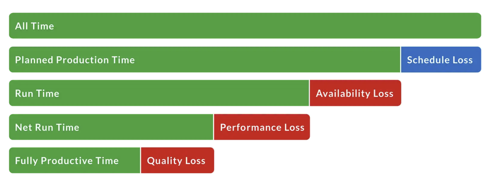

# Full Data Warehousing Project w/ ETL, EDA and Power BI Dashboard

# 1. Project Description

## 1.1. Company Overview

The name of the Polish manufacturing company is: *LOMPSTAR*

LOMPSTAR operates in the home appliance (white goods) industry and is responsible for producing components and modules for two major appliance manufacturers: HAUSBERG and WEISSTECH. The company’s business depends heavily on its production performance, as it can gain or lose projects based on efficiency, quality, and delivery reliability.

This project is based on solving a real-life operational challenge focused on production data.

## 1.2. Production Overview

The company is responsible for producing 8 different products for 3 different appliance models divided between new appliances and spare parts for older versions. The appliances are:

- **HAUSBERG:** DuraWash 500 (dishwasher) and BakePro 700 (built-in oven)
- **WEISSTECH:**  AquaMaster 360 (washing machine)

It’s know that the engineering team label the appliance versions to manage production of both new parts and spare parts. The structure follows the logic:

- The company produces **Drum Unit V1, V2, and V3** for Weisstech.
- **Version V3** corresponds to the newest appliance model.
- **Versions V1 and V2** correspond to older models and are produced as spare parts.

## 1.3. Organization Structure

LOMPSTAR is a large scale manufacturing company, and it has the following production structure: 

- 1 Plant Manager
    - João Miguel Ferreira 🇵🇹
- 1 Production Unit Manager (PUM)
    - Eduardo de Jesus Pato 🇧🇷
- 4 Shift Leaders
    - Ana Sofia Martins 🇵🇹
    - Ricardo Lopes Silva 🇵🇹
    - Lukas Schneider 🇩🇪
    - Tiago Fernandes Rocha 🇵🇹
- 24 Team Leaders
    - Bruno Carvalho 🇵🇹
    - Inês Teixeira 🇵🇹
    - Rafael Oliveira 🇧🇷
    - Hugo Mendes 🇵🇹
    - Daniela Santos 🇵🇹
    - Sergio Ramírez 🇪🇸
    - Luís Correia 🇵🇹
    - Catarina Sousa 🇵🇹
    - Miguel Duarte 🇵🇹
    - Andrés Navarro 🇪🇸
    - Fábio Pinto 🇵🇹
    - Joana Marques 🇵🇹
    - Diego Herrera 🇪🇸
    - André Gonçalves 🇵🇹
    - Leon Kowalski 🇵🇱
    - Ricardo Nunes 🇵🇹
    - Beatriz Rocha 🇵🇹
    - Paulo Cardoso 🇵🇹
    - Javier Ortega 🇪🇸
    - Mariana Lopes 🇵🇹
    - Carlos Eduardo 🇧🇷
    - Thiago Martins 🇧🇷
    - Sofia Neves 🇵🇹
    - Daniel Costa 🇵🇹
- 800+ Workers

## 1.4. Production Structure

### 1.4.1 Shifts Architecture:

### **Shift W – Ana Sofia Martins 🇵🇹**

1. Bruno Carvalho 🇵🇹 / Ship 1 / Drum Unit
2. Inês Teixeira 🇵🇹 / Ship 1 / Drum Unit
3. Sergio Ramírez 🇪🇸 / Ship 1 / Motor Unit
4. Miguel Duarte 🇵🇹 / Ship 1 / Drum Unit
5. Beatriz Rocha 🇵🇹 / Ship 1 / Motor Unit
6. Thiago Martins 🇧🇷 / Ship 1 / Motor Unit

### **Shift X – Ricardo Lopes Silva 🇵🇹**

1. Hugo Mendes 🇵🇹 / Ship 2 / Door Panel (incl. Spare Parts)
2. Daniela Santos 🇵🇹 / Ship 2 / Door Panel (incl. Spare Parts)
3. Andrés Navarro 🇪🇸 / Ship 2 / Door Panel (incl. Spare Parts)
4. Fábio Pinto 🇵🇹 / Ship 2 / Side Panel (incl. Spare Parts)
5. Ricardo Nunes 🇵🇹 / Ship 2 / Side Panel (incl. Spare Parts)
6. Carlos Eduardo 🇧🇷 / Ship 2 / Side Panel (incl. Spare Parts)

### **Shift Y – Lukas Schneider 🇩🇪**

1. Rafael Oliveira 🇧🇷 / Ship 3 / Main Board
2. Luís Correia 🇵🇹 / Ship 3 / Main Board
3. Catarina Sousa 🇵🇹 / Ship 3 / Main Board
4. Diego Herrera 🇪🇸 / Ship 3 / Power Board
5. André Gonçalves 🇵🇹 / Ship 3 / Power Board
6. Sofia Neves 🇵🇹 / Ship 3 / Power Board

### **Shift Z – Tiago Fernandes Rocha 🇵🇹**

1. Joana Marques 🇵🇹 / Ship 3 / Control Panel
2. Leon Kowalski 🇵🇱 / Ship 3 / Control Panel
3. Paulo Cardoso 🇵🇹 / Ship 3 / Display Board
4. Javier Ortega 🇪🇸 / Ship 3 / Display Board
5. Mariana Lopes 🇵🇹 / Ship 3 / Display Board
6. Daniel Costa 🇵🇹 / Ship 3 / Control Panel

### 1.4.1 Products

1. Drum Unit - Produced at JIT - For WEISSTECH
2. Motor Unit - Produced at JIT - For WEISSTECH
3. Door Panel / Including SPARE PARTS - Produced at JIT - For WEISSTECH and HAUSBERG
4. Side Panel / Including SPARE PARTS - Produced at JIT  - For WEISSTECH and HAUSBERG
5. Main Board - For HAUSBERG
6. Power Board - for HAUSBERG
7. Display Board - for WEISSTECH and HAUSBERG
8. Control Panel - For WEISSTECH and HAUSBERG

### 1.4.1 Facilities Distribution

### **Ship 1 / JIT / Drive Units**

- Bruno Carvalho 🇵🇹 / **Ship 1** / Drum Unit
- Inês Teixeira 🇵🇹 / **Ship 1** / Drum Unit
- Miguel Duarte 🇵🇹 / **Ship 1** / Drum Unit
- Sergio Ramírez 🇪🇸 / **Ship 1** / Motor Unit
- Beatriz Rocha 🇵🇹 / **Ship 1** / Motor Unit
- Thiago Martins 🇧🇷 / **Ship 1** / Motor Unit

---

### **Ship 2 / JIT / Panels**

- Hugo Mendes 🇵🇹 / **Ship 2** / Door Panel (incl. Spare Parts)
- Daniela Santos 🇵🇹 / **Ship 2** / Door Panel (incl. Spare Parts)
- Andrés Navarro 🇪🇸 / **Ship 2** / Door Panel (incl. Spare Parts)
- Fábio Pinto 🇵🇹 / **Ship 2** / Side Panel (incl. Spare Parts)
- Ricardo Nunes 🇵🇹 / **Ship 2** / Side Panel (incl. Spare Parts)
- Eduardo Pato 🇧🇷 / **Ship 2** / Side Panel (incl. Spare Parts)

---

### **Ship 3 / Assembly / Boards + Control Panel**

- Rafael Oliveira 🇧🇷 / **Ship 3** / Main Board
- Luís Correia 🇵🇹 / **Ship 3** / Main Board
- Catarina Sousa 🇵🇹 / **Ship 3** / Main Board
- Diego Herrera 🇪🇸 / **Ship 3** / Power Board
- André Gonçalves 🇵🇹 / **Ship 3** / Power Board
- Sofia Neves 🇵🇹 / **Ship 3** / Power Board
- Paulo Cardoso 🇵🇹 / **Ship 3** / Display Board
- Javier Ortega 🇪🇸 / **Ship 3** / Display Board
- Mariana Lopes 🇵🇹 / **Ship 3** / Display Board
- Joana Marques 🇵🇹 / **Ship 3** / Control Panel
- Leon Kowalski 🇵🇱 / **Ship 3** / Control Panel
- Daniel Costa 🇵🇹 / **Ship 3** / Control Panel

## 1.5. Company Issue

Each Team Leader is responsible for completing an excel document called “Production Summary”. This document consolidates data from various production systems, along with manual inputs such as accidents, non-conforming parts, reworked parts, downtime, and other operational observations. The current system has automations that insert data into the report, but the report lacks data treatment and data normalization.

At the end of all 3 shifts of the day (Morning, Evening and Night), the summaries are printed, collected and sent to the Production Unit Manager, who analyses which shift/product had the worst performance of the day.

The performance is measured by a manufacturing KPI called Overall Equipament Efectiviness (OEE) and it’s calculated by the formula:

- OEE = Availability * Performance * Quality
- Availability = Run Time / Planned Production Time
- Performance = ( Total Parts Produced * Cycle Time ) / Run Time
- Quality = Good Parts / Total Parts Produced

The following image explains the dynamic:

Right now, the company relies explicicitly on Excel with advanced formulas to calculate the OEE per product produced. This approach has several issues, including:

- **Lack of Automation:** The excel files are .xlsx documents, containing no macros to automate internal processes.
- **Human Errors:** The excel files doesn’t contain any advanced features in Excel to reduce human erros, limit user interactions or standardize data input.
- **No Data Storage:** There’s no usage of database for production summaries data.
- **No Insights:** Decision-making is limited to the most recent production day, making it impossible to identify patterns or obtain a comprehensive, long-term view of performance.

## 1.6. Improvement Proposal

To solve the business problem a big project was created. It consist in 5 steps:

### Step 1 - Excel Automation With VBA

The current Excel-based process is highly manual and time-consuming. Therefore, the first step is to establish a standardized method for creating production summaries, inputting data, and managing files.

The production summary includes data validation rules, user access restrictions, and macros that automatically collect, organize, and structure the data into a standardized tabular format.

### Step 2 - EL Process and Data Storage With Python and SQL

To extract the structured data from each excel file and Load to the database, it’s going to be used python. This step only includes the Extract and Load phase, since the first transformation will be done by the macros created previously in Excel. 

With this approach, data will be stored in the database each time the team leader finishes a production summary. 

The database used will be: Azure SQL Database.

### Step 3 - Warehousing in Azure SQL Database

After the data being loaded to our database, the transformation process will take place within Azure SQL.

A layered data architecture will be implemented, consisting of:

- **Bronze Layer:**
    
    Stores raw data exactly as extracted from Excel, with no data cleaning.
    
- **Silver Layer:**
    
    Contains cleaned and structured data, including:
    
    - Removal of duplicates
    - Standardized formats
    - Basic calculations (e.g., normalized fields)
- **Gold Layer:**
    
    Contains business-ready data optimized for analysis, including:
    
    - OEE calculations
    - Aggregations by Ship, Shift, Product, and Team Leader
    - KPI-ready tables for reporting

This structure improves data reliability and supports efficient analysis.

### Step 4 - Data Visualization in Power BI Desktop

Power BI Desktop will be used to create interactive dashboards based on the Gold Layer data.

The dashboards will allow analysis of:

- OEE deep analysis
- Downtime analysis
- Performance per product, production line & team leader

The goal is to transform raw data into clear and actionable insights.