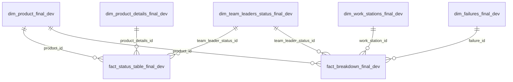

# Data Catalog - Gold Layer Final Views (`*_final_dev`)

**Database:** `db_manufacturing_warehouse` · **Schema:** `gold_layer` · **Defined in:** `06.gold_layer_secondary_views.sql`

This catalog documents the **final, dashboard-facing presentation layer** of the warehouse: the set of `*_final_dev` views that end users and BI tools (Power BI) connect to. These are the **only** objects reports should query - everything beneath them (bronze, silver, gold base views) is plumbing.

---

## 1. Why these views exist

The warehouse follows a medallion architecture (bronze → silver → gold). The gold base views in `05.gold_layer.sql` already expose a business-ready star schema, with all OEE math calculated in `fact_status_enriched_dev`. The secondary views in `06.gold_layer_secondary_views.sql` add one last layer on top, for two reasons:

1. **One consistent connection surface.** The BI model connects to a single family of views (`*_final_dev`), all sourced from one script. If the layers underneath change, the dashboard contract does not.
2. **The data-quality split of the status fact.** Real production reports contain physically impossible rows (negative run time, OEE above 100%). Instead of deleting them, the enriched status fact is **split** into a clean view and a "trash" (quarantine) view. Both are thin filters over the *same* enriched base view, so the clean and trash sides can never disagree on a formula - the OEE math lives once.

All objects here are **views**: they store no data and always reflect the current state of the silver layer. No refresh step is needed.

---

## 2. Database Schema



> **No date dimension.** Both facts carry the calendar date directly in `full_date` (DATE). Date attributes (year, quarter, month, week, …) come from the BI-side calendar table (`03.scripts/powerbi/calendar_table.md`), related to the facts on `full_date`.

| View | Type | Grain (one row per…) | Purpose |
|---|---|---|---|
| `fact_status_table_final_dev` | Fact | production line × shift × day | **Clean** shift status fact with OEE metrics - the main fact for the dashboard |
| `fact_status_trash_final_dev` | Fact (quarantine) | production line × shift × day | Status rows that break a physical/measurement rule (see §5) |
| `fact_breakdown_final_dev` | Fact | downtime/failure event | Breakdown & downtime events for the breakdown report |
| `dim_work_stations_final_dev` | Dimension | work station × equipment | Where a breakdown happened |
| `dim_failures_final_dev` | Dimension | failure type × sub code | How/why a breakdown happened |
| `dim_product_final_dev` | Dimension | production line | What was being produced |
| `dim_team_leaders_status_final_dev` | Dimension | leader × shift × crew size | Who ran the shift |
| `dim_product_details_final_dev` | Dimension | product version × cycle time | Theoretical cycle time used in the performance calc |

The dimension views and the breakdown fact are **full passthroughs** (`SELECT *`) over their `05.gold_layer.sql` base views: dimensions keep every member and the breakdown fact keeps every row. The clean/trash split applies **only** to the status fact.

---

## 3. Facts

### 3.1 `fact_status_table_final_dev` - clean status fact (OEE)

**Source:** `gold_layer.fact_status_enriched_dev`, filtered to rows that pass all data-quality rules
(`run_time >= 0 AND performance <= 1.1496 AND oee <= 1`).
**Grain:** one row per production line, per shift, per day.

Downtime figures are joined in from the breakdown fact, rolled up to date + product + shift. Because the breakdown source has no shift column, the shift is derived from `event_time` using fixed windows: morning 06:00–14:00, afternoon 14:00–22:00, evening 22:00–06:00.

| Column | Type | Description |
|---|---|---|
| `source_id` | VARCHAR(250) | Natural key of the source status report row. Unique; use it to trace any row back to the raw data. |
| `full_date` | DATE | Calendar date of the shift; relate the BI calendar table to this column |
| `product_id` | INT | FK → `dim_product_final_dev` |
| `team_leader_status_id` | INT | FK → `dim_team_leaders_status_final_dev` |
| `product_details_id` | INT | FK → `dim_product_details_final_dev` |
| `total_produced` | INT | Parts actually produced (good + bad) |
| `nok_parts` | INT | Defective (Not-OK) parts |
| `reworked_parts` | INT | Parts that needed rework before passing |
| `scrap_cost_eur` | DECIMAL(10,2) | Per-unit scrap cost (€) of the appliance model, from `03.dashboard/model_scrap_costs.xlsx` (NULL when the model has no costing entry) |
| `total_scrap_cost_eur` | DECIMAL(12,2) | `nok_parts × scrap_cost_eur` - total scrap cost (€) of the shift row |
| `all_time` | INT | Total shift length in **minutes** (480; 450 for the evening/night shift) |
| `observations` | VARCHAR | Free-text remarks from the team leader |
| `ok_parts` | INT | `total_produced − nok_parts` |
| `quality` | DECIMAL(9,4) | `ok_parts / total_produced` |
| `planned_production_time` | INT | `all_time − planned_downtime` (minutes) |
| `availability_loss` | INT | Unplanned downtime (minutes) rolled up from the breakdown fact |
| `run_time` | INT | `all_time − planned_downtime − unplanned_downtime` (minutes) |
| `performance` | DECIMAL(9,4) | `(total_produced × cycle_time/60) / run_time` - actual vs. theoretical speed |
| `availability` | DECIMAL(9,4) | `run_time / planned_production_time` |
| `fully_productive_time` | INT | `all_time − unplanned_downtime − planned_downtime` (minutes) |
| `pplh` | DECIMAL(9,4) | `total_produced / ((fully_productive_time / 60) × num_operators)` - Parts Per Labor Hour (parts per operator-hour) |
| `ok_first_parts` | INT | `ok_parts − reworked_parts` - good on the first pass |
| `ftq` | DECIMAL(9,4) | First Time Quality: `ok_first_parts / total_produced` |
| `oee` | DECIMAL(9,4) | `availability × performance × quality` |

> **Reading the ratios:** all four OEE-family columns are decimal fractions (`0.8500` = 85 %). `performance` values between **1.00 and 1.1496** are kept in the clean view *on purpose* - they are inside the accepted cycle-time measurement tolerance, and viewers still get a visible warning that the line ran above its theoretical speed.

### 3.2 `fact_breakdown_final_dev` - breakdown / downtime events

**Source:** passthrough over `gold_layer.fact_breakdown_table_dev`.
**Grain:** one row per breakdown or downtime event.
No data-quality split applies here: the breakdown is an independent fact with its own report, so every row is kept. Any breakdown-side quality management is handled downstream inside Power BI.

The breakdown source itself has no shift columns, but the source `ID` embeds the report file name (`01012022 Shift D.xlsm<line>_<n>`). The crew letter is parsed from it, and the reported shift + `team_leader_status_id` are recovered by joining back to the status report of the same file (same date, line, crew letter). Breakdowns whose status report was quarantined by the partial-duplicate rule (or never filed) keep their rows with a NULL `shift` / `team_leader_status_id`; `shift_abc` is always populated.

| Column | Type | Description |
|---|---|---|
| `source_id` | VARCHAR(250) | Natural key of the source breakdown row |
| `full_date` | DATE | Calendar date of the event; relate the BI calendar table to this column |
| `product_id` | INT | FK → `dim_product_final_dev` |
| `work_station_id` | INT | FK → `dim_work_stations_final_dev` |
| `failure_id` | INT | FK → `dim_failures_final_dev` |
| `team_leader_status_id` | INT | FK → `dim_team_leaders_status_final_dev` (NULL when no matching status report) - **use this column for the Power BI relationship** |
| `shift` | VARCHAR(10) | Time-of-day shift reported in the source file: `morning`, `afternoon`, `evening` (NULL when no matching status report) |
| `shift_abc` | VARCHAR(10) | Rotating crew letter (`Shift A` … `Shift D`) parsed from the source file name |
| `event_time` | TIME | Clock time the event was recorded |
| `event_hour` | INT | Hour of the event (0–23), for hourly analysis |
| `hour_bucket` | VARCHAR | Event hour formatted `'HH:00'`, for axis labels |
| `unplanned_downtime` | INT | Unplanned downtime caused by the event (minutes) |
| `planned_downtime` | INT | Planned downtime attributed to the event (minutes) |
| `failure_description` | VARCHAR | Free-text description of the failure |

---

## 4. Dimensions

> There is no date dimension: both facts carry `full_date` directly (see §2).

### 4.1 `dim_work_stations_final_dev`

| Column | Type | Description |
|---|---|---|
| `work_station_id` | INT | Surrogate key |
| `work_station` | VARCHAR(50) | Work station where the breakdown occurred (`'N/A'` when not reported) |
| `equipment` | VARCHAR(50) | Specific equipment involved (`'N/A'` when not reported) |

### 4.2 `dim_failures_final_dev`

| Column | Type | Description |
|---|---|---|
| `failure_id` | INT | Surrogate key |
| `failure_type` | VARCHAR(50) | Failure category (`'N/A'` when not reported) |
| `sub_code` | VARCHAR(50) | Detailed failure sub-code within the category |

### 4.3 `dim_product_final_dev`

Parsed from the raw production-line string (e.g. `V1 HAUSBERG BakePro 700 POWER BOARD` → version `V1`, manufacturer `HAUSBERG`, model `BakePro 700`, product `POWER BOARD`).

| Column | Type | Description |
|---|---|---|
| `product_id` | INT | Surrogate key |
| `full_line` | VARCHAR(100) | Original full line name from the source |
| `version` | VARCHAR(10) | Product version prefix (`V1`, `V2`, `V3`, `STAND`) |
| `manufacturer` | VARCHAR(50) | Appliance manufacturer (e.g. `HAUSBERG`, `WEISSTECH`) |
| `model` | VARCHAR(50) | Appliance model (may be multi-word, e.g. `BakePro 700`) |
| `product` | VARCHAR(50) | Part produced on the line (e.g. `POWER BOARD`, `DRUM UNIT`) |

### 4.4 `dim_team_leaders_status_final_dev`

| Column | Type | Description |
|---|---|---|
| `team_leader_status_id` | INT | Surrogate key |
| `shift` | VARCHAR(10) | Time-of-day shift: `morning`, `afternoon`, `evening` |
| `shift_abc` | VARCHAR(10) | Rotating crew letter (`Shift A` … `Shift D`) |
| `team_leader` | VARCHAR(30) | Team leader responsible for the shift |
| `num_operators` | INT | Number of operators on the crew |

### 4.5 `dim_product_details_final_dev`

| Column | Type | Description |
|---|---|---|
| `product_details_id` | INT | Surrogate key |
| `version` | VARCHAR(25) | Product version |
| `cycle_time` | DECIMAL(5,2) | Theoretical time to produce one part, in **seconds** (converted to minutes inside the performance calculation) |

---

## 5. The trash view - `fact_status_trash_final_dev` logic

### Why quarantine instead of delete?

Shift reports are filled in by people, and some rows are **physically impossible** - more downtime than the shift has minutes, or an OEE above 100 %. Deleting them would silently distort history and hide the data-quality problem. Instead:

- Bad rows are **moved out of the KPI calculations** (so averages, OEE trends and targets aren't poisoned),
- but stay **visible and auditable** in the trash view, traceable back to the raw report via `source_id`,
- and because both views filter the *same* enriched base view, the rules live in one place. Fixing a row at the source automatically moves it from trash to clean on the next query - no reload, no reprocessing.

### The rules

A status row goes to trash when **any** of these is true:

| Rule | Meaning | Why it's trash |
|---|---|---|
| `run_time < 0` | Recorded downtime exceeds the total shift time | Impossible in real life - the source timing entries are wrong |
| `run_time IS NULL` | When run time = 0, it converts to NULL | The availability/performance math cannot be trusted |
| `performance > 1.1496` | Line ran more than ~15 % faster than its theoretical cycle time | Beyond the accepted measurement tolerance - `cycle_time` was mis-measured, so the figure is treated as wrong. Values from **1.00 to 1.1496 stay in the clean view on purpose** as a visible warning |
| `performance IS NULL` | `run_time = 0`, so the ratio is undefined (division guarded by `NULLIF`) | No denominator - the metric cannot be computed |
| `oee > 1` | Overall efficiency above 100 % | Physically impossible |
| `oee IS NULL` | One of availability/performance/quality is NULL | Composite metric incomplete |

The clean view applies the exact complement (`run_time >= 0 AND performance <= 1.1496 AND oee <= 1`). In SQL, a `NULL` fails these comparisons, so NULL rows fall through to trash - the two views are a **complete, non-overlapping partition** of `fact_status_enriched_dev`:

```
fact_status_enriched_dev  =  fact_status_table_final_dev  ∪  fact_status_trash_final_dev
                             (clean - powers the KPIs)       (quarantine - powers the audit)
```

### What end users should do with it

- **Report builders:** never blend trash rows into OEE/production KPIs. If you want a data-quality page, source it from the trash view alone (row counts by line/shift/leader make a good "reporting discipline" indicator).
- **Team leaders / process owners:** rows here mean the *source report* needs correcting. Once fixed upstream, the row disappears from trash automatically.

---

## 6. Usage notes

- **Views store no data.** Every query reflects the current silver-layer state; there is no refresh schedule to wait for.
- **`SELECT *` passthroughs do not auto-track schema changes** in T-SQL. If a base gold view gains or drops a column, re-run `06.gold_layer_secondary_views.sql` (or `sp_refreshview`) so the final views follow.
- **`_dev` suffix:** all objects are the development generation of the model; names will drop the suffix on promotion.
- **Keys:** as views, these objects carry no PK/FK constraints - referential integrity is enforced upstream in the silver layer. Join facts to dimensions on the `*_id` columns shown above; join dates on the facts' `full_date` column (the BI calendar table relates to it directly).

---