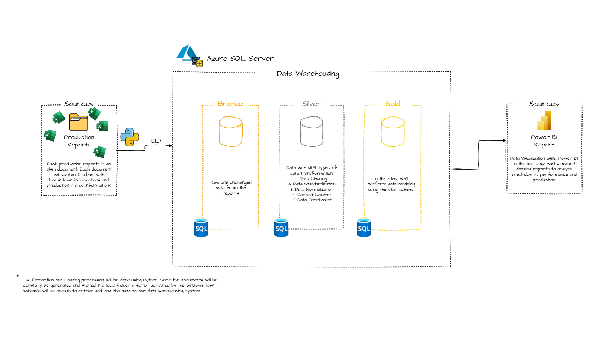
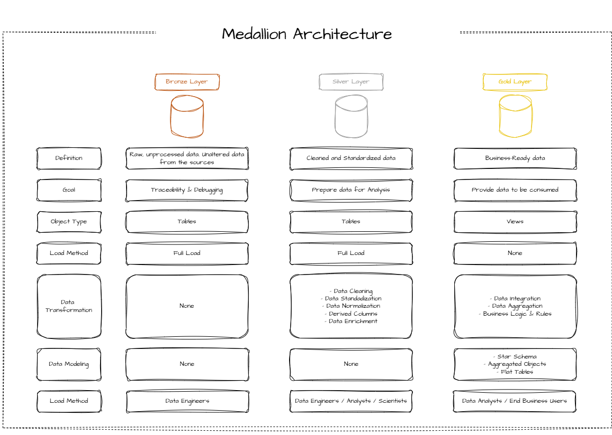
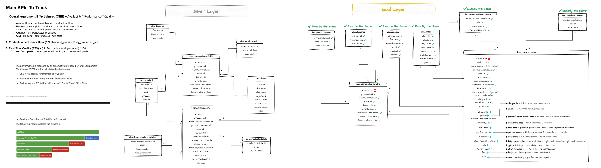

# Manufacturing Data Warehousing & Analytics

An end-to-end analytics engineering project for a (fictional) manufacturing company, **LOMPSTAR**,
that turns manually-tracked production data into a governed data warehouse and a
Power BI dashboard built around **OEE** (Overall Equipment Effectiveness).

The project follows a full data lifecycle: **Excel/VBA** standardizes data entry →
**Python** extracts and loads it → **SQL Server** models it through a
bronze/silver/gold **medallion architecture** → **Power BI** visualizes it.

> **All data in this repository is artificial**, generated for demonstration purposes.
> LOMPSTAR, HAUSBERG and WEISSTECH are fictional; every name, product and figure is
> invented and represents no real organisation, person or product.

---

## Table of Contents

- [Business Problem](#business-problem)
- [Architecture](#architecture)
- [Tech Stack](#tech-stack)
- [The Pipeline, Phase by Phase](#the-pipeline-phase-by-phase)
- [Data Model (Gold Layer)](#data-model-gold-layer)
- [Dashboard](#dashboard)
- [Repository Structure](#repository-structure)
- [Getting Started](#getting-started)
- [Design Decisions & Notes](#design-decisions--notes)
- [References & Credits](#references--credits)
- [License](#license)

---

## Business Problem

LOMPSTAR produces components for two appliance makers (HAUSBERG and WEISSTECH).
Each shift, production leaders fill in a "Production Summary" Excel file by hand. The
original process had no validation, no central storage, and no history - decisions
could only be made about the most recent production day, and human error was
uncontrolled.

**Goal:** replace the manual, file-based process with a repeatable pipeline and a
data warehouse that supports long-term analysis of production performance, measured
by OEE:

```
OEE = Availability × Performance × Quality
```

See [`00.project_documentation/project_description.md`](00.project_documentation/project_description.md)
for the full business framing.

---

## Architecture



The warehouse uses a medallion (bronze → silver → gold) architecture:



| Layer | Purpose |
|-------|---------|
| 🟤 **Bronze** | Raw data loaded exactly as extracted from Excel - no cleaning. |
| ⚪ **Silver** | Cleaned, de-duplicated, conformed data; star-schema dimensions built here. |
| 🟡 **Gold** | Business-ready views with all OEE math; the only layer the dashboard queries. |

---

## Tech Stack

| Stage | Tool |
|-------|------|
| Data entry standardization | **Excel** + **VBA** |
| Extract & Load | **Python** (pandas, openpyxl, pyodbc) |
| Storage & Transformation | **SQL Server** (T-SQL) - prototyped on Azure SQL Database |
| Exploratory analysis | **Jupyter Notebook** (pandas, SQLAlchemy) |
| Visualization | **Power BI** (DAX, custom HTML/CSS visuals) |

---

## The Pipeline, Phase by Phase

### Phase 1 - Standardization (Excel + VBA)
A single macro-enabled template enforces how each production's
data is entered: cascading data-validation dropdowns, accent/diacritic normalization,
and a time grid. A VBA macro (`report_datasets()`) flattens each report into two
clean tables (`tbl_status`, `tbl_failures`) with `snake_case` headers on a hidden
`Dataset` sheet. Details: [`02.scripts/excel/excel_description.md`](02.scripts/excel/excel_description.md).

### Phase 2 - Extract & Load (Python)
[`el_pipeline.py`](02.scripts/python/el_pipeline.py) scans the current month's folder
for new `.xlsm` files, skips already-processed files via a `file_log` table, reads the `Dataset` sheet, and loads both tables into the Bronze layer.
Every file is logged as `success` or `error`. A one-shot historical backfill of the
synthetic CSVs is handled by [`bulk_insert_data.py`](02.scripts/python/bulk_insert_data.py). This is a not 100% complete step, waiting for future revisions.

### Phase 3 - Warehousing (SQL)
Numbered SQL scripts build the warehouse in order (bronze tables → silver modeling →
gold views). The silver layer reshapes two raw tables into a **galaxy (two fact star
schema)**; the gold layer adds all OEE calculations and a **clean/quarantine split** of
the status fact (see [Design Decisions](#design-decisions--notes)).

### Phase 4 - Analytics (Power BI)
Three report pages - **Overview**, **Breakdown**, and **Breakdown Deep Search** -
connect to the gold `*_final_dev` views. KPI color thresholds are derived per
manufacturer from the EDA notebook. Requirements:
[`03.dashboard/dashboard_requirements.md`](03.dashboard/dashboard_requirements.md).

---

## Data Model (Gold Layer)



A two-fact (galaxy) star schema. The dashboard connects **only** to the `*_final_dev`
views.

| Object | Type | Grain |
|--------|------|-------|
| `fact_status_table_final_dev` | Fact | production line × shift × day (clean, OEE) |
| `fact_status_trash_final_dev` | Fact | same grain - quarantined data-quality failures |
| `fact_breakdown_final_dev` | Fact | one downtime/failure event |
| `dim_product_final_dev` | Dimension | production line (version, manufacturer, model, product) |
| `dim_product_details_final_dev` | Dimension | product version × cycle time |
| `dim_team_leaders_status_final_dev` | Dimension | leader × shift × crew size |
| `dim_work_stations_final_dev` | Dimension | work station × equipment |
| `dim_failures_final_dev` | Dimension | failure type × sub code |

> There is **no date dimension** - both facts carry `full_date` directly, related to a
> calendar table built on the Power BI side.

Full column-level documentation:
[`02.scripts/sql/07.gold_layer_data_catalog.md`](02.scripts/sql/07.gold_layer_data_catalog.md).

---

## Dashboard

These are the sketches made before building the real reports on Power BI Desktop. They were made on drawio with the usage of Nano Banana chart images to materialize the main requisitions of the "client".


Built in Power BI Desktop ([`03.dashboard/production_control.pbix`](03.dashboard/production_control.pbix)):

- **Overview** - OEE matrix across all lines; OEE by team leader / shift / product
  (parameter-switched axis); OEE gauge vs. target; Performance / Availability / Quality
  / PPLH / FTQ / Scrap-cost cards; scrap per product.
- **Breakdown** - OEE gauge; Pareto of unplanned failures per line / category; downtime
  by time of day; total lost by sub-category.
- **Breakdown Deep Search** - decomposition tree (Product → Category → Sub-Category).

KPI thresholds are set per manufacturer (HAUSBERG / WEISSTECH) from the third-quartile
values in the EDA, with a **purple** flag for the physically-impossible >100% performance
rows that survive within measurement tolerance. This decision was made to show that a certain cycle time is wrongly measured. If the performance is above 100% it means that the cycle time is way above than it should be. 

---

## Repository Structure

```
00.bulk_insert_data/     Synthetic source CSVs (git-ignored - multi-GB, not versioned)
00.project_documentation/  Business brief, product listing, OEE goals, notes
01.images/               Architecture & schema diagrams, icons, mockups
02.scripts/
  ├─ excel/              VBA modules + Excel-layer documentation
  ├─ python/             el_pipeline.py, bulk_insert_data.py, eda_metrics.ipynb
  ├─ sql/                Numbered build scripts (01→06) + gold-layer data catalog
  └─ powerbi/            DAX measures + HTML/CSS for custom card visuals
03.dashboard/            production_control.pbix, requirements, color palette, screenshots
```

---

## Getting Started

### Prerequisites
- SQL Server (2019+ or Azure SQL Database) and a client such as SSMS or Azure Data Studio
- [Microsoft ODBC Driver 18 for SQL Server](https://learn.microsoft.com/en-us/sql/connect/odbc/download-odbc-driver-for-sql-server)
- [Python 3.10+](https://www.python.org/downloads/)
- [Power BI Desktop](https://www.microsoft.com/en-us/power-platform/products/power-bi/desktop) (to open the `.pbix`)
- Microsoft Excel with macros enabled (to open the `.xlsm` template)

#### Python libraries

| Library | Used by | Purpose | Docs |
|---------|---------|---------|------|
| `pandas` | `el_pipeline.py`, `bulk_insert_data.py`, `eda_metrics.ipynb` | Reads the `Dataset` sheet and reshapes both tables before load | [install guide](https://pandas.pydata.org/docs/getting_started/install.html) |
| `openpyxl` | `el_pipeline.py` | Engine `pandas` uses to open the macro-enabled `.xlsm` reports | [docs](https://openpyxl.readthedocs.io/en/stable/) |
| `pyodbc` | all Python scripts + notebook | SQL Server connection (pairs with the ODBC driver above) | [wiki](https://github.com/mkleehammer/pyodbc/wiki) |
| `SQLAlchemy` | `eda_metrics.ipynb` | Engine behind `pandas.read_sql` for querying the gold views | [install guide](https://docs.sqlalchemy.org/en/20/intro.html#installation) |
| `jupyterlab` | `eda_metrics.ipynb` | Runs the exploratory analysis notebook | [jupyter.org/install](https://jupyter.org/install) |

Everything else the scripts import (`os`, `uuid`, `datetime`, `urllib`) ships with the
standard library.

### 1. Build the warehouse
Run the SQL scripts **in numeric order** against your database:
```
01.database_creation_script.sql   →  02.bronze_layer_tables.sql
03.bulk_insert_data.sql*          →  04.silver_layer_tables.sql
05.gold_layer.sql                 →  06.gold_layer_secondary_views.sql
```
\* Update the `<path-to-bulk-insert-data-folder>` placeholder to point at your local
CSV folder before running the bulk load.

### 2. Load new reports (ongoing)
```bash
python 02.scripts/python/el_pipeline.py
```

### 3. Run the exploratory analysis (Jupyter)
[`eda_metrics.ipynb`](02.scripts/python/eda_metrics.ipynb) queries the gold views to
derive the third-quartile KPI thresholds used by the dashboard, so run it **after** the
warehouse is built. Launch it with whichever front-end you prefer:

```bash
# JupyterLab - the current interface
jupyter lab 02.scripts/python/eda_metrics.ipynb

# or the classic Notebook interface
pip install notebook
jupyter notebook 02.scripts/python/eda_metrics.ipynb
```

The browser opens at `http://localhost:8888`. Alternatively, open the `.ipynb` directly
in [VS Code](https://code.visualstudio.com/) with the
[Jupyter extension](https://marketplace.visualstudio.com/items?itemName=ms-toolsai.jupyter),
which runs the notebook without starting a server yourself.

Installation references: [jupyter.org/install](https://jupyter.org/install) ·
[JupyterLab docs](https://jupyterlab.readthedocs.io/en/stable/getting_started/installation.html) ·
[running the notebook server](https://docs.jupyter.org/en/latest/running.html)

> The committed notebook keeps its saved outputs from an earlier run. Re-execute the
> cells against your own database - the numbers will differ from the ones shown.

### 6. Open the dashboard
Open [`03.dashboard/production_control.pbix`](03.dashboard/production_control.pbix)
in Power BI Desktop and point its data source at your gold-layer views.

> **Note on data:** the source CSVs are git-ignored because they exceed GitHub's file
> size limit. The pipeline and SQL are fully runnable; regenerate or substitute your own
> data to reproduce the numbers.

---

## Design Decisions & Notes

- **Quarantine, don't delete.** Human-entered shift reports sometimes contain
  physically-impossible rows (negative run time, OEE > 100%). Rather than deleting
  them, the status fact is split into a **clean** view (powers the KPIs) and a
  **trash** view (auditable, traceable to source). Both filter the *same* enriched base
  view, so the OEE formula lives in exactly one place.
- **No date dimension.** Facts carry `full_date`; date attributes come from a Power BI
  calendar table. Simpler for a single-grain-per-day model.
- **`_dev` suffix** on gold objects marks the development generation of the model; the
  suffix is intended to drop on promotion.
- **Learning notes** - honest write-ups of mistakes made along the way (e.g. loading to
  prod without a dev DB, minute-rounding of downtime) are kept in
  [`00.project_documentation/mistakes.md`](00.project_documentation/mistakes.md).

---

## References & Credits

See [`REFERENCES.md`](REFERENCES.md). Key sources:
- [Lean Production - OEE](https://www.leanproduction.com/oee/) for all the KPIs calculations and Lean thinking;
- [ISO 22400-2](https://www.iso.org/standard/54497.html) for all the industries standards;
- [DataWithBaraa - SQL Data Warehouse Project](https://github.com/DataWithBaraa/sql-data-warehouse-project)
for the medallion structure, SQL loading patterns and drawio sketches.

Also want to give more credits to [Baraa Salkini](https://www.linkedin.com/in/baraa-khatib-salkini/)! 
If it wasn't for his free content I would've never start working on the field or wanting to learn more about data engineering. Since I've always been short on money while studying 3 years ago, the attitute to teach for free is a very special and rare nowadays.

You can check all his work at:
- **Website:** https://www.datawithbaraa.com/
- **Youtube:** https://www.youtube.com/@DataWithBaraa
- **Linkedin:** https://www.linkedin.com/in/baraa-khatib-salkini/

---

## License

Code is released under the **MIT License**; documentation and design assets under
**CC BY 4.0**; synthetic data under **CC0**. Third-party vendor logos are excluded and
remain the property of their owners. Full terms in [`LICENSE`](LICENSE).
