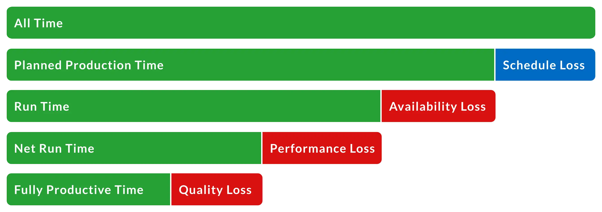

# Full Data Warehousing Project w/ ETL, EDA and Power BI Dashboard

# 1. Project Description

## 1.1. Company Overview

The name of the German manufacturing company is: *LOMPSTAR*

LOMPSTAR operates in the automotive industry and is responsible for producing components for two major car manufacturers: BMW and Mercedes-Benz. ****The company’s business depends heavily on its production performance, as it can gain or lose projects based on efficiency, quality, and delivery reliability.

This project is based on solving a real-life operational challenge focused on production data.

## 1.2. Production Overview

The company is responsible for producing 8 different products for 3 different car models divided between new vehicles and spare parts for older versions. The cars are:

- **BMW:** X7 and BMW 420d Gran Coupé
- **Mercedez:**  GLE 53

It’s know that the engineering team label the vehicle versions to manage production of both new parts and spare parts. The structure follows the logic:

- The company produces **Rear Axle A, C, and D** for Mercedes-Benz.
- **Version D** corresponds to the newest car model.
- **Versions A and C** correspond to older models and are produced as spare parts.

## 1.3. Organization Structure

LOMPSTAR is a large scale manufacturing company, and it has the following production structure: 

- 1 Plant Manager
    - João Miguel Ferreira 🇵🇹
- 1 Production Unit Manager (PUM)
    - Eduardo de Jesus Pato 🇧🇷
- 4 Shift Leaders
    - Ana Sofia Martins 🇵🇹
    - Ricardo Lopes Silva 🇵🇹
    - Lukas Schneider 🇩🇪
    - Tiago Fernandes Rocha 🇵🇹
- 24 Team Leaders
    - Bruno Carvalho 🇵🇹
    - Inês Teixeira 🇵🇹
    - Rafael Oliveira 🇧🇷
    - Hugo Mendes 🇵🇹
    - Daniela Santos 🇵🇹
    - Sergio Ramírez 🇪🇸
    - Luís Correia 🇵🇹
    - Catarina Sousa 🇵🇹
    - Miguel Duarte 🇵🇹
    - Andrés Navarro 🇪🇸
    - Fábio Pinto 🇵🇹
    - Joana Marques 🇵🇹
    - Diego Herrera 🇪🇸
    - André Gonçalves 🇵🇹
    - Leon Kowalski 🇵🇱
    - Ricardo Nunes 🇵🇹
    - Beatriz Rocha 🇵🇹
    - Paulo Cardoso 🇵🇹
    - Javier Ortega 🇪🇸
    - Mariana Lopes 🇵🇹
    - Carlos Eduardo 🇧🇷
    - Thiago Martins 🇧🇷
    - Sofia Neves 🇵🇹
    - Daniel Costa 🇵🇹
- 800+ Workers

## 1.4. Production Structure

### 1.4.1 Shifts Architecture:

### **Shift A – Ana Sofia Martins 🇵🇹**

1. Bruno Carvalho 🇵🇹 / Ship 1 / Rear Axle
2. Inês Teixeira 🇵🇹 / Ship 1 / Rear Axle
3. Sergio Ramírez 🇪🇸 / Ship 1 / Front Axle
4. Miguel Duarte 🇵🇹 / Ship 1 / Rear Axle
5. Beatriz Rocha 🇵🇹 / Ship 1 / Front Axle
6. Thiago Martins 🇧🇷 / Ship 1 / Front Axle

### **Shift B – Ricardo Lopes Silva 🇵🇹**

1. Hugo Mendes 🇵🇹 / Ship 2 / Rear Bumper (incl. Spare Parts)
2. Daniela Santos 🇵🇹 / Ship 2 / Rear Bumper (incl. Spare Parts)
3. Andrés Navarro 🇪🇸 / Ship 2 / Rear Bumper (incl. Spare Parts)
4. Fábio Pinto 🇵🇹 / Ship 2 / Front Bumper (incl. Spare Parts)
5. Ricardo Nunes 🇵🇹 / Ship 2 / Front Bumper (incl. Spare Parts)
6. Carlos Eduardo 🇧🇷 / Ship 2 / Front Bumper (incl. Spare Parts)

### **Shift C – Lukas Schneider 🇩🇪**

1. Rafael Oliveira 🇧🇷 / Ship 3 / B-Pillar
2. Luís Correia 🇵🇹 / Ship 3 / B-Pillar
3. Catarina Sousa 🇵🇹 / Ship 3 / B-Pillar
4. Diego Herrera 🇪🇸 / Ship 3 / A-Pillar
5. André Gonçalves 🇵🇹 / Ship 3 / A-Pillar
6. Sofia Neves 🇵🇹 / Ship 3 / A-Pillar

### **Shift D – Tiago Fernandes Rocha 🇵🇹**

1. Joana Marques 🇵🇹 / Ship 3 / Instrument Panel
2. Leon Kowalski 🇵🇱 / Ship 3 / Instrument Panel
3. Paulo Cardoso 🇵🇹 / Ship 3 / C-Pillar
4. Javier Ortega 🇪🇸 / Ship 3 / C-Pillar
5. Mariana Lopes 🇵🇹 / Ship 3 / C-Pillar
6. Daniel Costa 🇵🇹 / Ship 3 / Instrument Panel

### 1.4.1 Products

1. Rear Axle - Produced at JIT - For MERCEDEZ
2. Front Axle - Produced at JIT - For MERCEDEZ
3. Rear Bumper / Including SPARE PARTS - Produced at JIT - For MERCEDEZ and BMW
4. Front Bumper / Including SPARE PARTS - Produced at JIT  - For MERCEDEZ and BMW
5. B-Pillar - For BMW
6. A-Pillar - for BMW
7. C-Pillar - for MERCEDEZ and BMW
8. Instrumental Panel - For Mercedez and BMW

### 1.4.1 Facilities Distribution

### **Ship 1 / JIT / Axles**

- Bruno Carvalho 🇵🇹 / **Ship 1** / Rear Axle
- Inês Teixeira 🇵🇹 / **Ship 1** / Rear Axle
- Miguel Duarte 🇵🇹 / **Ship 1** / Rear Axle
- Sergio Ramírez 🇪🇸 / **Ship 1** / Front Axle
- Beatriz Rocha 🇵🇹 / **Ship 1** / Front Axle
- Thiago Martins 🇧🇷 / **Ship 1** / Front Axle

---

### **Ship 2 / JIT / Bumpers**

- Hugo Mendes 🇵🇹 / **Ship 2** / Rear Bumper (incl. Spare Parts)
- Daniela Santos 🇵🇹 / **Ship 2** / Rear Bumper (incl. Spare Parts)
- Andrés Navarro 🇪🇸 / **Ship 2** / Rear Bumper (incl. Spare Parts)
- Fábio Pinto 🇵🇹 / **Ship 2** / Front Bumper (incl. Spare Parts)
- Ricardo Nunes 🇵🇹 / **Ship 2** / Front Bumper (incl. Spare Parts)
- Eduardo Pato 🇧🇷 / **Ship 2** / Front Bumper (incl. Spare Parts)

---

### **Ship 3 / Welding / Pillars + Instrument Panel**

- Rafael Oliveira 🇧🇷 / **Ship 3** / B-Pillar
- Luís Correia 🇵🇹 / **Ship 3** / B-Pillar
- Catarina Sousa 🇵🇹 / **Ship 3** / B-Pillar
- Diego Herrera 🇪🇸 / **Ship 3** / A-Pillar
- André Gonçalves 🇵🇹 / **Ship 3** / A-Pillar
- Sofia Neves 🇵🇹 / **Ship 3** / A-Pillar
- Paulo Cardoso 🇵🇹 / **Ship 3** / C-Pillar
- Javier Ortega 🇪🇸 / **Ship 3** / C-Pillar
- Mariana Lopes 🇵🇹 / **Ship 3** / C-Pillar
- Joana Marques 🇵🇹 / **Ship 3** / Instrument Panel
- Leon Kowalski 🇵🇱 / **Ship 3** / Instrument Panel
- Daniel Costa 🇵🇹 / **Ship 3** / Instrument Panel

## 1.5. Company Issue

Each Team Leader is responsible for completing an excel document called “Production Summary”. This document consolidates data from various production systems, along with manual inputs such as accidents, non-conforming parts, reworked parts, downtime, and other operational observations.

At the beginning of each shift, Team Leaders create a copy of the Excel file and continuously update it throughout the shift.

At the end of all 3 shifts of the day (Morning, Evening and Night), the summaries are collected and sent to the Production Unit Manager, who analyses which shift/product had the worst performance of the day.

The performance is measure by an automotive KPI called Overall Equipament Efectiviness (OEE) and it’s calculated by the formula:

- OEE = Availability * Performance * Quality
- Availability = Run Time / Planned Production Time
- Performance = ( Total Parts Produced * Cycle Time ) / Run Time
- Quality = Good Parts / Total Parts Produced

The following image explains the dynamic:

Right now, the company relies explicicitly on Excel with advanced formulas to calculate the OEE per product produced. This approach has several issues, including:

- **Lack of Automation:** The excel files are .xlsx documents, containing no macros to automate internal processes.
- **Human Errors:** The excel files doesn’t contain any advanced features in Excel to reduce human erros, limit user interactions or standardize data input.
- **No Data Storage:** There’s no usage of database for production summaries data.
- **No Insights:** Decision-making is limited to the most recent production day, making it impossible to identify patterns or obtain a comprehensive, long-term view of performance.

## 1.6. Improvement Proposal

To solve the business problem a big project was created. It consist in 5 steps:

### Step 1 - Excel Automation With VBA

The current Excel-based process is highly manual and time-consuming. Therefore, the first step is to establish a standardized method for creating production summaries, inputting data, and managing files.

To address this, a centralized Excel workbook called the “Summary Generator” was developed. In this file, Team Leaders input their data, and a personalized production summary is automatically generated.

The production summary includes data validation rules, user access restrictions, and macros that automatically collect, organize, and structure the data into a standardized tabular format.

### Step 2 - EL Process and Data Storage With Python and SQL

To extract the structured data from each excel file and Load to the database, it’s going to be used python. This step only includes the Extract and Load phase, since the first transformation will be done by the macros created previously in Excel. 

With this approach, data will be stored in the database each time the team leader finishes a production summary. 

The database used will be: Azure SQL Database.

### Step 3 - Warehousing in Azure SQL Database

After the data being loaded to our database, the transformation process will take place within Azure SQL.

A layered data architecture will be implemented, consisting of:

- **Bronze Layer:**
    
    Stores raw data exactly as extracted from Excel, with no data cleaning.
    
- **Silver Layer:**
    
    Contains cleaned and structured data, including:
    
    - Removal of duplicates
    - Standardized formats
    - Basic calculations (e.g., normalized fields)
- **Gold Layer:**
    
    Contains business-ready data optimized for analysis, including:
    
    - OEE calculations
    - Aggregations by Ship, Shift, Product, and Team Leader
    - KPI-ready tables for reporting

This structure improves data reliability and supports efficient analysis.

### Step 4 - Data Visualization in Power BI Desktop

Power BI Desktop will be used to create interactive dashboards based on the Gold Layer data.

The dashboards will allow analysis of:

- OEE deep analysis
- Downtime analysis
- Performance per product, production line & team leader

The goal is to transform raw data into clear and actionable insights.

### Step 5 - Basic Automation with Power BI Service and Power Platform

To reduce manual work and ensure data availability, basic automation will be implemented using Power BI Service and Power Platform tools. This include small features such as schedule refreshes, and alerts based on critical OEE percentages.

This step ensures that stakeholders always have access to up-to-date information with minimal manual intervention.